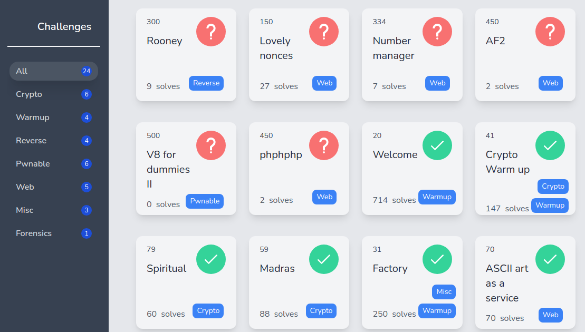

# ASISCTF 2021: ASCII art as a service (Web)


[ASIS CTF](https://asisctf.com/) is a heavyweight CTF happening since 2013. The Rating weight on CTFTime for this event is currently 89.22, which is a hardcore valuation.

The 2021 edition started on October 22, with 24 challenges for several skills.

I can speak for the web challenges, which were incredibly fun!



# The Challenge

 ```"You can convert your images to ASCII art. It is AaaS! 🤣 Go here"```


...

# References

* ASISCTF: https://asisctf.com/
* CTF Time Event: https://ctftime.org/event/1415
* Repo with the artifacts discussed here: https://github.com/Neptunians/asisctf-2021-writeup-ascii_art_as_a_service
* Team: [FireShell](https://fireshellsecurity.team/)
* Team Twitter: [@fireshellst](https://twitter.com/fireshellst)
* Follow me too :) [@NeptunianHacks](twitter.com/NeptunianHacks)